# FPGA Image Processing — Chapters 2 & 3

> **Project:** Hardware Implementation of Image Processing Algorithms on FPGA  
> **Board:** Altera/Intel FPGA DE2  
> **HDL:** Verilog HDL  
> **Main algorithms:** RGB to Grayscale, Median Filter, Histogram Equalization

---

## CHAPTER 2 — THEORETICAL BACKGROUND

### 2.1 Digital Image Processing

Digital Image Processing is the study of methods for processing, analyzing, and improving digital images using computers or digital hardware.

A digital image is represented as a matrix of pixels. Each pixel contains information about the brightness or color at its corresponding position.

The main objectives of image processing in this project are:

- Improve image quality.
- Remove image noise.
- Enhance image contrast.
- Prepare image data for further analysis and processing.

The project focuses on three fundamental image-processing algorithms:

1. **RGB to Grayscale**
2. **Median Filter**
3. **Histogram Equalization**

These algorithms are implemented as hardware processing modules on the FPGA.

---

### 2.2 RGB to Grayscale

A color RGB image consists of three color components:

- **R — Red**
- **G — Green**
- **B — Blue**

Each component is represented by 8 bits. Therefore, one RGB pixel contains **24 bits** of data.

The project converts each RGB pixel into an 8-bit grayscale pixel using the standard luminance model:

\[
Y = 0.299R + 0.587G + 0.114B
\]

The coefficients represent the contribution of each RGB component to perceived brightness.

To implement the calculation efficiently in hardware, the coefficients can be represented using scaled integer values. The resulting grayscale value is then limited to the valid 8-bit range.

An additional brightness parameter is also considered. This parameter is added to the grayscale value, while values exceeding 255 are saturated to 255.

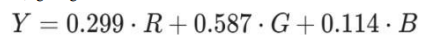

*Figure 2.1 — RGB to Grayscale luminance formula.*

#### Processing flow

The RGB-to-Grayscale processing can be summarized as:

```text
RGB Pixel
   │
   ├── R channel
   ├── G channel
   └── B channel
        │
        ▼
Luminance calculation
        │
        ▼
Brightness adjustment
        │
        ▼
8-bit grayscale pixel
```

---

### 2.3 Median Filter

The Median Filter is a nonlinear image-processing technique used to reduce noise while preserving image edges.

It is particularly effective for:

- Salt-and-pepper noise.
- Speckle noise.

The implementation uses a **3 × 3 sliding window**. For every pixel, the nine neighboring pixel values inside the window are considered.

The basic processing sequence is:

1. Select a 3 × 3 neighborhood.
2. Collect the nine pixel values.
3. Sort the nine values.
4. Select the middle value as the median.
5. Assign the median value to the output pixel.

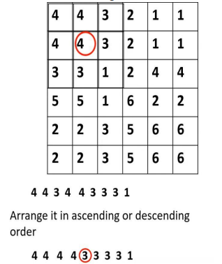

*Figure 2.2 — Example of selecting the median value from a 3 × 3 pixel window.*

#### Hardware-oriented sorting

To improve the suitability of the algorithm for FPGA implementation, the project uses a **Sort Network**.

A Sort Network consists of fixed comparator elements connected in a predetermined structure. Unlike software sorting algorithms whose comparison sequence may depend on intermediate results, the comparison structure of a Sort Network is fixed.

This makes the algorithm suitable for parallel hardware implementation.

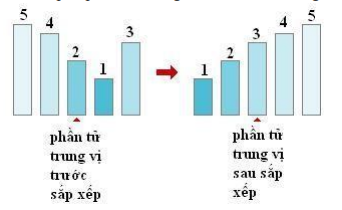

*Figure 2.3 — Concept of sorting the pixel values in the median filter.*

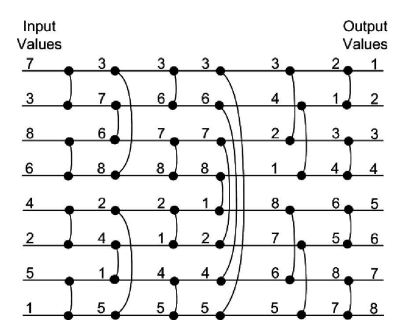

*Figure 2.4 — Sort Network used to arrange the pixel values.*

The hardware-oriented structure allows multiple comparisons to be performed in parallel, which is advantageous for FPGA-based image processing.

---

### 2.4 Histogram Equalization

Histogram Equalization is an image enhancement technique used to improve image contrast by redistributing the grayscale levels of an image.

For an 8-bit grayscale image, the possible grayscale values are:

\[
0 \leq r \leq 255
\]

A histogram represents the frequency of occurrence of each grayscale value.

- A narrow histogram generally indicates low contrast.
- A wider histogram generally indicates higher contrast.

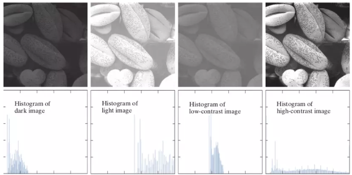

*Figure 2.5 — Example of images and their corresponding histograms with different contrast levels.*

The Histogram Equalization process consists of the following main stages.

#### 2.4.1 Histogram generation

The first stage counts the number of occurrences of every grayscale value in the input image.

For an 8-bit grayscale image, the histogram contains **256 bins**, corresponding to grayscale values from 0 to 255.

The frequency distribution is then used to determine the probability of occurrence of each grayscale level.

#### 2.4.2 Cumulative Distribution Function

After obtaining the probability distribution, the cumulative distribution function (CDF) is calculated.

The CDF represents the accumulated probability from grayscale level 0 up to the current grayscale level.

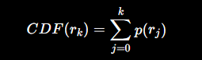

*Figure 2.6 — Cumulative Distribution Function used for Histogram Equalization.*

The CDF is monotonically increasing from 0 to 1 and is used as the basis for mapping the original grayscale values to new grayscale values.

#### 2.4.3 Grayscale mapping

The new grayscale value is calculated from the CDF.

For an 8-bit grayscale image, the number of grayscale levels is:

\[
L = 256
\]

Therefore, the mapping can be represented as:

\[
s_k = 255 \times CDF(r_k)
\]

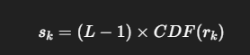

*Figure 2.7 — Grayscale transformation based on the CDF.*

The resulting value is converted to an integer and used as the new pixel value.

#### 2.4.4 Output image

Finally, each original grayscale value \(r_k\) is replaced by its corresponding mapped value \(s_k\).

The objective is to redistribute the grayscale levels so that the image has improved overall contrast, particularly in regions that were originally too dark or too bright.

---

# CHAPTER 3 — SYSTEM DESIGN

## 3.1 System Block Diagram

The FPGA image-processing system is designed as a sequential processing architecture.

The main processing stages are:

1. RGB to Grayscale
2. Median Filter
3. Histogram Equalization

Image data is transferred from the PC to the FPGA and stored in SDRAM. The data is then processed sequentially by the corresponding hardware modules.

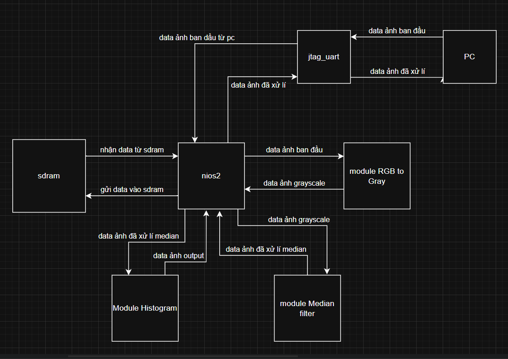

*Figure 3.1 — Overall block diagram of the FPGA image-processing system.*

### Main components

| Component | Function |
|---|---|
| **Nios II** | Controls data flow and the SDRAM/JTAG UART related operations |
| **SDRAM** | Stores input and intermediate/output image data |
| **JTAG UART** | Provides communication between the PC and the FPGA system |
| **RGB to Gray** | Converts RGB image data into 8-bit grayscale |
| **Median Filter** | Removes image noise using a median filter |
| **Histogram Equalization** | Enhances image contrast |

The overall architecture follows a sequential processing model:

```text
PC
 │
 │ Image Data
 ▼
JTAG UART
 │
 ▼
SDRAM
 │
 ▼
RGB to Grayscale
 │
 ▼
Median Filter
 │
 ▼
Histogram Equalization
 │
 ▼
SDRAM
 │
 ▼
PC
```

---

## 3.2 Module Design

### 3.2.1 RGB to Gray Module

The RGB to Gray module receives three 8-bit color channels:

- Red
- Green
- Blue

The module performs the luminance calculation and applies the brightness adjustment.

The resulting value is saturated at the maximum 8-bit value when necessary.

#### Processing structure

```text
       R ─────┐
              │
       G ─────┼──► Luminance Calculation
              │
       B ─────┘
                       │
                       ▼
              Brightness Adjustment
                       │
                       ▼
                 Saturation Check
                       │
                       ▼
                Grayscale Output
```

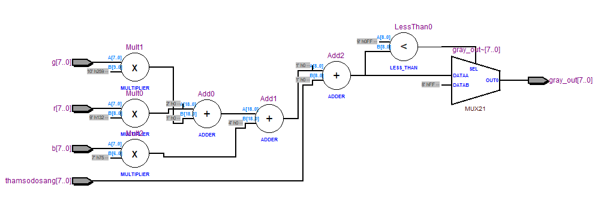

*Figure 3.2 — Hardware netlist of the RGB to Gray module.*

---

### 3.2.2 Median Filter Module

The Median Filter module processes a 3 × 3 pixel window.

The nine pixels are passed through a fixed comparison network. The comparison results are propagated through multiple stages until the median value is obtained.

The architecture is divided into:

1. Input pixel window.
2. Comparator/swap operations.
3. Multiple sorting stages.
4. Median extraction.

#### Median Filter processing flow

```text
3 × 3 Pixel Window
        │
        ▼
   9 Pixel Values
        │
        ▼
 Comparator Network
        │
        ▼
 Multiple Sorting Stages
        │
        ▼
   Median Selection
        │
        ▼
 Filtered Pixel
```

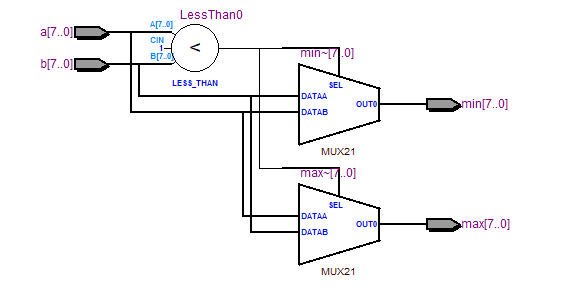

*Figure 3.3 — Comparator/swap hardware used by the Median Filter.*

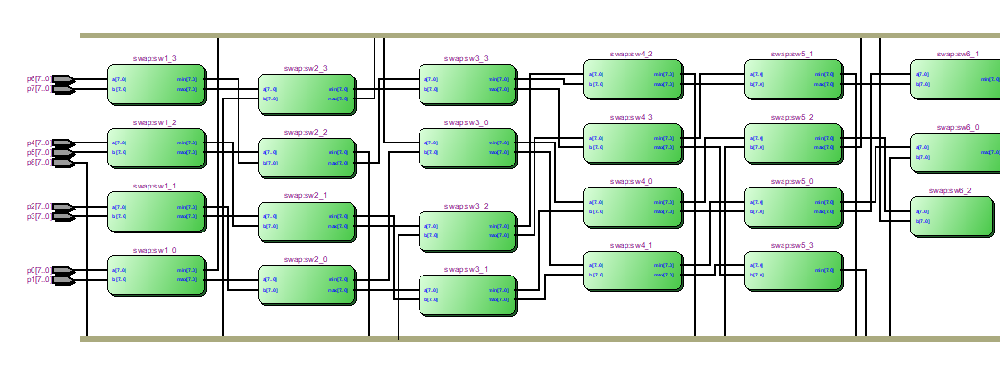

*Figure 3.4 — Hardware netlist of the Median Filter.*

The use of a fixed comparator network allows the sorting operation to be implemented as combinational hardware and provides opportunities for parallel processing.

---

### 3.2.3 Histogram Equalization Module

The Histogram Equalization implementation is divided into three main hardware stages:

1. **Histogram generation**
2. **CDF and LUT generation**
3. **Pixel equalization**

#### Stage 1 — Histogram generation

The histogram module scans the input grayscale image and increments the corresponding histogram bin for every pixel.

For an 8-bit grayscale image, the module maintains 256 histogram bins.

```text
Input Pixel
    │
    ▼
Read Grayscale Value
    │
    ▼
Select Corresponding Histogram Bin
    │
    ▼
Increment Frequency
    │
    ▼
Process Next Pixel
```

#### Stage 2 — CDF and LUT generation

After the histogram has been generated, the cumulative distribution is calculated.

The CDF is used to generate a lookup table (LUT), where each input grayscale level is associated with its new equalized grayscale value.

```text
Histogram
    │
    ▼
Cumulative Sum
    │
    ▼
CDF
    │
    ▼
Grayscale Mapping
    │
    ▼
256-entry LUT
```

#### Stage 3 — Pixel equalization

For each input pixel, its grayscale value is used as an index into the LUT.

The corresponding LUT value becomes the output grayscale value.

```text
Input Grayscale Pixel
        │
        ▼
      LUT Index
        │
        ▼
Equalized Grayscale Value
        │
        ▼
   Output Image
```

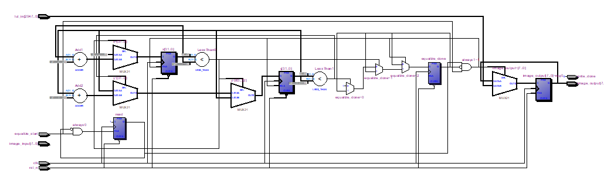

*Figure 3.5 — Hardware netlist related to the Histogram Equalization processing.*

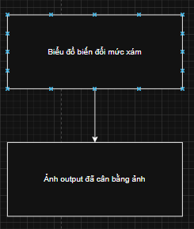

*Figure 3.6 — Processing flow for Histogram Equalization.*

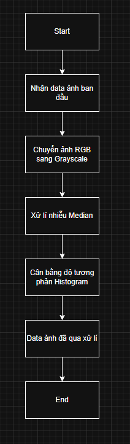

*Figure 3.7 — Grayscale equalization processing flow.*

---

## 3.3 Image Memory and Storage

SDRAM is used to store the input image and the intermediate/output images generated by the processing modules.

The memory provides a large storage area and acts as an intermediate buffer during image processing.

The grayscale image is stored using **8 bits per pixel**, meaning that each pixel occupies one byte in SDRAM.

A conceptual memory organization used by the system is:

| Memory Region | Stored Data |
|---|---|
| `0x00800000` | Input image |
| `0x00800000 + IMAGE_SIZE` | Image after Median Filter |
| `0x00800000 + 2 × IMAGE_SIZE` | Image after Histogram Equalization |

### Data transfer flow

#### PC → FPGA

```text
Input Image (.jpg)
       │
       ▼
Convert to grayscale / binary data
       │
       ▼
Binary image (.bin)
       │
       ▼
JTAG / System Console
       │
       ▼
SDRAM
```

Each grayscale pixel is represented by one byte in the binary image file.

#### FPGA → PC

After image processing is completed, the output image data is read from the corresponding SDRAM region and stored as a binary file.

```text
SDRAM
  │
  ▼
Processed Image Data
  │
  ▼
Binary File (.bin)
  │
  ▼
Image Reconstruction
  │
  ▼
Output Image
```

The report describes the use of Intel Quartus System Console, Tcl scripting, and the JTAG Avalon Master Bridge for transferring image data between the PC and SDRAM.

---

## 3.4 Overall Algorithm Flow

The complete image-processing procedure follows a sequential pipeline of processing stages.


*Figure 3.8 — Algorithm flow for the image-processing system.*

The overall operation can be summarized as:

```text
┌──────────────────────┐
│ Receive Image from PC│
└──────────┬───────────┘
           │
           ▼
┌──────────────────────┐
│ RGB → Grayscale      │
└──────────┬───────────┘
           │
           ▼
┌──────────────────────┐
│ Median Filter        │
│ Noise Reduction      │
└──────────┬───────────┘
           │
           ▼
┌──────────────────────┐
│ Histogram Equalization│
│ Contrast Enhancement │
└──────────┬───────────┘
           │
           ▼
┌──────────────────────┐
│ Store Result         │
└──────────────────────┘
```

### Processing sequence

1. Receive image data from the PC.
2. Convert RGB data into 8-bit grayscale.
3. Apply the 3 × 3 Median Filter to reduce noise.
4. Generate the image histogram.
5. Calculate the CDF and grayscale mapping LUT.
6. Apply the LUT to the image pixels.
7. Store the processed image in SDRAM.
8. Retrieve the processed image for output.

---

## Design Summary

The system combines three fundamental image-processing algorithms with an FPGA-based hardware architecture:

```text
                 FPGA Image Processing System
                           │
        ┌──────────────────┼──────────────────┐
        │                  │                  │
        ▼                  ▼                  ▼
   RGB to Gray        Median Filter    Histogram Equalization
        │                  │                  │
        ▼                  ▼                  ▼
   Color → Gray       Noise Removal     Contrast Enhancement
```

The design uses **Nios II, SDRAM, JTAG communication, and dedicated hardware processing modules** to implement the complete image-processing flow on the DE2 FPGA platform.
